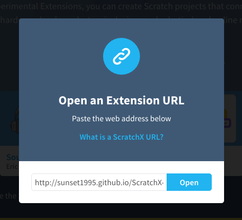
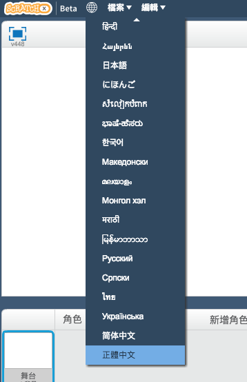
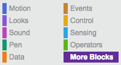
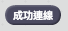
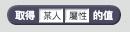

# ScratchX websocket extension

> 注意：不是所有 ScratchX extension 都是安全的，使用前請先確定來源是可信的！

ScratchX websocket extension 可讓 ScratchX 透過 websocket 與伺服器做即時溝通。此外，附有一個網頁可讀取手機重力感應器的資訊傳到伺服器上讓 ScratchX 讀取。  
這篇會包含：
- ScratchX websocket extension 使用說明
- 利用 c9 架設自己的伺服器
- 網頁讀取重力感應器說明

各網頁傳送門(aka 連結)：
- [ScratchX 官網](http://scratchx.org/)
- [c9.io 官網](https://c9.io/)
- [ScratchX websocket extension](http://sunset1995.github.io/ScratchX-ext/extensions/ws.js)
- [讀取手機重力感應器的網頁](http://sunset1995.github.io/ScratchX-ext/static/gsensor.html)

## ScratchX websocket extension 使用說明
進入 [ScratchX 官網](http://scratchx.org/) 點選 _Open Extension URL_  
將 ScratchX websocket extension 網址 `http://sunset1995.github.io/ScratchX-ext/extensions/ws.js` 貼於欄位中，按下 _Open_（如下圖）  
  

若你想要更改成中文版面，可點選畫面左上方的地球按鈕，拉到最下面選取 _正體中文_（如下圖），以下示範會採用英文版面  
  

點選 _More Block_ 即可看到此 extension 提供的方塊（見下圖）  
  

  
初始化連線，設定你的名字為 _某人_(請改成你自己的，建議只由英文跟數字組成) 並連接到位於 _url_ 的伺服器。  
這個方塊只有在尚未成功連線時被執行才會發揮效用。  
__注意__，這個方塊會卡住程式的執行直到連線成功或失敗。  

  
如果你已經成功連線會得到 _1_ 否則得到 _0_  

  
連線後你可以更改你自己的屬性，_屬性_ 你可以任意取（建議只由英文跟數字組成）也可以有很多個，如：_x_、_y_、_vx_、_vy_、_handsome_、_cute_ 之類的屬性  
_值_ 為該屬性的值，如：_a_ = _9.8_ 此處 _9.8_ 即為屬性 _a_ 的值  
你只能操作你自己的屬性  

  
只要他們知道你連線時設定的名字，你所有的屬性都可以讓別人透過此方塊讀取  
同樣的，你只要知道別人是用什麼名字連線伺服器，你也可以讀取他們的任何屬性  
